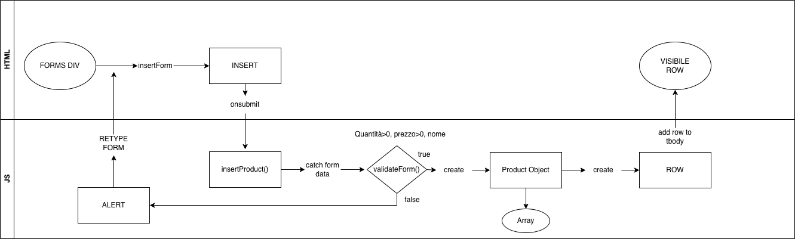

# Warehouse Management

A single-page application for managing warehouse inventory through a user-friendly interface.

Core Features:
  - Product List: Display all products with:
  - Name
  - Available quantity
  - Category (e.g., Electronics, Clothing, Food)
  - Unit price
  - Add Product:
    - Form to create new products
    - Input validation (e.g., required name, quantity > 0, price > 0)
  - Remove Product:
    - Each product row includes a button to delete that item

Technical Requirements:
  - Language: JavaScript or TypeScript
  - Framework: Any JS framework (Angular or React preferred)
  - State Management: Native framework tools (component state, reactive forms, etc.)

Styling: Free choice (CSS, SCSS, Bootstrap, Tailwind, etc.)

Data Persistence: Not required — in-memory storage is sufficient

# Working Method

1. **HTML Core Features**
   - Tables and forms (Insert and Update)

2. **Vanilla JavaScript**
   - Insert method:
     - Pool lane diagram:
       
       - In this method, I forced the page to not reload and catch the event submitted by the user. After I catched the values, 
       I'm able to check them with the validation method (it gaves me an alert if the values are not correct and force the user to retype them again).
       Later on I create an object to store in an array, I will use this array to keep track of the products and to delete them.
       The last step, is to call the tbody and append the new row to add.
       
   - Delete method:

3. **CSS -> BootStrap**
